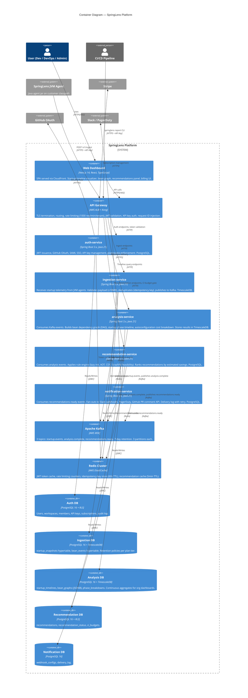

# C4 Container Diagram — SpringLens

```mermaid
C4Container
    title Container Diagram — SpringLens Platform

    Person(user, "User (Dev / DevOps / Admin)")
    Person_Ext(cicd, "CI/CD Pipeline")

    System_Boundary(springlens, "SpringLens Platform") {

        Container(frontend, "Web Dashboard", "Next.js 14, React, TypeScript", "SPA served via CloudFront. Startup timeline visualizer, bean graph, recommendations panel, billing UI.")

        Container(api_gw, "API Gateway", "AWS ALB + Kong", "TLS termination, routing, rate limiting (1000 req/min/tenant), JWT validation, API key auth, request ID injection.")

        Container(auth_svc, "auth-service", "Spring Boot 3.x, Java 21", "JWT issuance, GitHub OAuth, SAML SSO, API key management, plan/quota enforcement. PostgreSQL.")

        Container(ingestion_svc, "ingestion-service", "Spring Boot 3.x, Java 21", "Receives startup telemetry from JVM agents. Validates payload (≤10MB), deduplicates (idempotency key), publishes to Kafka. TimescaleDB.")

        Container(analysis_svc, "analysis-service", "Spring Boot 3.x, Java 21", "Consumes Kafka events. Builds bean dependency graph (DAG), startup phase timeline, autoconfiguration cost breakdown. Stores results in TimescaleDB.")

        Container(recommendation_svc, "recommendation-service", "Spring Boot 3.x, Java 21", "Consumes analysis events. Applies rule engine (lazy init, AOT, CDS, GraalVM feasibility). Ranks recommendations by estimated savings. PostgreSQL.")

        Container(notification_svc, "notification-service", "Spring Boot 3.x, Java 21", "Consumes recommendations-ready events. Fan-outs to Slack webhooks, PagerDuty, GitHub PR comment API. Delivery log with retry. PostgreSQL.")

        Container(kafka, "Apache Kafka", "AWS MSK", "3 topics: startup.events, analysis.complete, recommendations.ready. 7-day retention. 3 partitions each.")

        Container(redis, "Redis Cluster", "AWS ElastiCache", "JWT token cache, rate limiting counters, idempotency key store (60s TTL), recommendation cache (5min TTL).")

        ContainerDb(auth_db, "Auth DB", "PostgreSQL 16 + RLS", "Users, workspaces, members, API keys, subscriptions, audit log.")
        ContainerDb(ingestion_db, "Ingestion DB", "PostgreSQL 16 + TimescaleDB", "startup_snapshots hypertable, bean_events hypertable. Retention policies per plan tier.")
        ContainerDb(analysis_db, "Analysis DB", "PostgreSQL 16 + TimescaleDB", "startup_timelines, bean_graphs (JSONB), phase_breakdowns. Continuous aggregates for org dashboards.")
        ContainerDb(recommendation_db, "Recommendation DB", "PostgreSQL 16 + RLS", "recommendations, recommendation_status, ci_budgets.")
        ContainerDb(notification_db, "Notification DB", "PostgreSQL 16", "webhook_configs, delivery_log.")
    }

    System_Ext(jvm_agent, "SpringLens JVM Agent", "Java agent jar on customer classpath")
    System_Ext(stripe, "Stripe")
    System_Ext(github_oauth, "GitHub OAuth")
    System_Ext(slack_pd, "Slack / PagerDuty")

    Rel(user, frontend, "Uses", "HTTPS/443")
    Rel(cicd, api_gw, "springlens report CLI", "HTTPS + API Key")
    Rel(frontend, api_gw, "API calls", "HTTPS/443")
    Rel(jvm_agent, api_gw, "POST /v1/ingest", "HTTPS + API Key")

    Rel(api_gw, auth_svc, "Auth endpoints, token validation", "HTTP")
    Rel(api_gw, ingestion_svc, "Ingest endpoints", "HTTP")
    Rel(api_gw, analysis_svc, "Timeline query endpoints", "HTTP")
    Rel(api_gw, recommendation_svc, "Recommendation endpoints, CI budget gate", "HTTP")

    Rel(ingestion_svc, kafka, "Publishes startup.events", "Kafka")
    Rel(analysis_svc, kafka, "Consumes startup.events, publishes analysis.complete", "Kafka")
    Rel(recommendation_svc, kafka, "Consumes analysis.complete, publishes recommendations.ready", "Kafka")
    Rel(notification_svc, kafka, "Consumes recommendations.ready", "Kafka")

    Rel(auth_svc, auth_db, "Reads/Writes", "JDBC")
    Rel(ingestion_svc, ingestion_db, "Reads/Writes", "JDBC")
    Rel(analysis_svc, analysis_db, "Reads/Writes", "JDBC")
    Rel(recommendation_svc, recommendation_db, "Reads/Writes", "JDBC")
    Rel(notification_svc, notification_db, "Reads/Writes", "JDBC")

    Rel(auth_svc, redis, "Token cache, rate limits", "Redis")
    Rel(ingestion_svc, redis, "Idempotency keys", "Redis")
    Rel(recommendation_svc, redis, "Recommendation cache", "Redis")

    Rel(auth_svc, github_oauth, "OAuth2 flow", "HTTPS")
    Rel(auth_svc, stripe, "Subscription management", "HTTPS")
    Rel(notification_svc, slack_pd, "Webhook delivery", "HTTPS")
```
