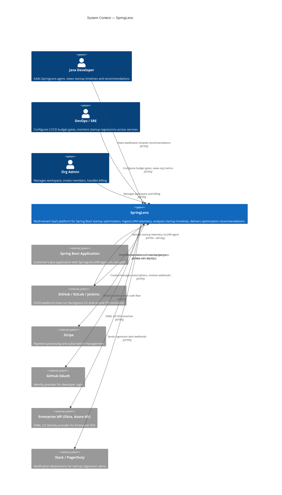

# C4 Context Diagram — SpringLens

```mermaid
C4Context
    title System Context — SpringLens

    Person(dev, "Java Developer", "Adds SpringLens agent, views startup timelines and recommendations")
    Person(devops, "DevOps / SRE", "Configures CI/CD budget gates, monitors startup regressions across services")
    Person(admin, "Org Admin", "Manages workspace, invites members, handles billing")

    System(springlens, "SpringLens", "Multi-tenant SaaS platform for Spring Boot startup optimization. Ingests JVM telemetry, analyzes startup timelines, delivers optimization recommendations.")

    System_Ext(springapp, "Spring Boot Application", "Customer's Java application with SpringLens JVM agent on classpath")
    System_Ext(github, "GitHub / GitLab / Jenkins", "CI/CD platforms that run SpringLens CLI and receive PR comments")
    System_Ext(stripe, "Stripe", "Payment processing and subscription management")
    System_Ext(github_oauth, "GitHub OAuth", "Identity provider for developer login")
    System_Ext(saml_idp, "Enterprise IdP (Okta, Azure AD)", "SAML 2.0 identity provider for Enterprise SSO")
    System_Ext(slack, "Slack / PagerDuty", "Notification destinations for startup regression alerts")

    Rel(dev, springlens, "Views dashboard, browses recommendations", "HTTPS")
    Rel(devops, springlens, "Configures budget gates, views org metrics", "HTTPS")
    Rel(admin, springlens, "Manages workspace and billing", "HTTPS")

    Rel(springapp, springlens, "Uploads startup telemetry via JVM agent", "HTTPS + API Key")
    Rel(github, springlens, "Posts startup metrics, checks budget gates", "HTTPS + API Key (CLI)")
    Rel(springlens, stripe, "Creates/manages subscriptions, receives webhooks", "HTTPS")
    Rel(springlens, github_oauth, "OAuth2 authorization code flow", "HTTPS")
    Rel(springlens, saml_idp, "SAML 2.0 SSO assertion", "HTTPS")
    Rel(springlens, slack, "Sends regression alert webhooks", "HTTPS")
    Rel(springlens, github, "Posts PR comments with startup metrics", "GitHub API / HTTPS")
```
