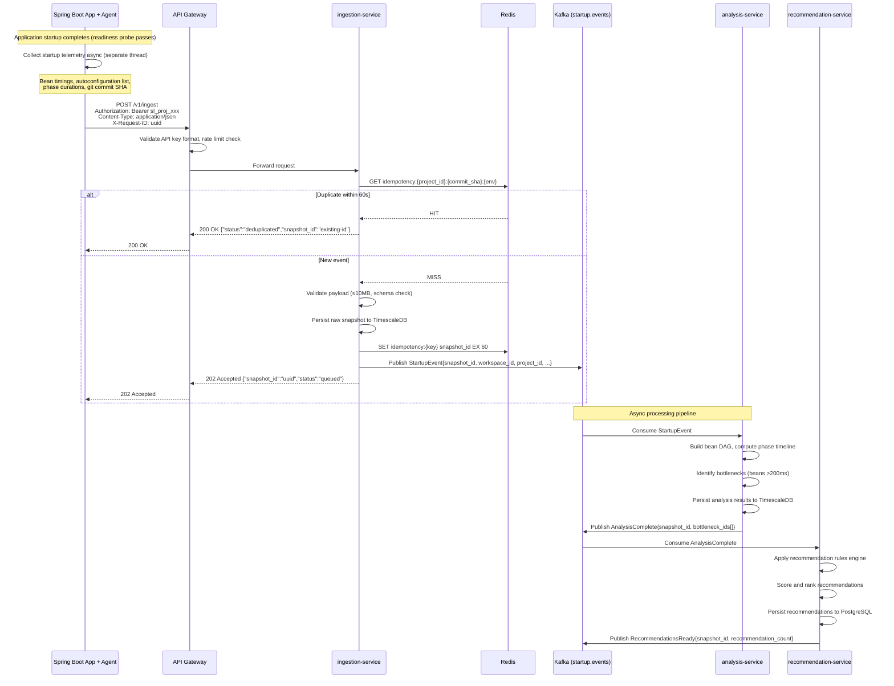

# Sequence Diagram — Agent Telemetry Ingestion

```mermaid
sequenceDiagram
    participant App as Spring Boot App + Agent
    participant GW as API Gateway
    participant Ingest as ingestion-service
    participant Redis as Redis
    participant Kafka as Kafka (startup.events)
    participant Analysis as analysis-service
    participant RecSvc as recommendation-service

    Note over App: Application startup completes (readiness probe passes)

    App->>App: Collect startup telemetry async (separate thread)
    Note over App: Bean timings, autoconfiguration list,<br/>phase durations, git commit SHA

    App->>GW: POST /v1/ingest<br/>Authorization: Bearer sl_proj_xxx<br/>Content-Type: application/json<br/>X-Request-ID: uuid
    GW->>GW: Validate API key format, rate limit check
    GW->>Ingest: Forward request

    Ingest->>Redis: GET idempotency:{project_id}:{commit_sha}:{env}
    alt Duplicate within 60s
        Redis-->>Ingest: HIT
        Ingest-->>GW: 200 OK {"status":"deduplicated","snapshot_id":"existing-id"}
        GW-->>App: 200 OK
    else New event
        Redis-->>Ingest: MISS
        Ingest->>Ingest: Validate payload (≤10MB, schema check)
        Ingest->>Ingest: Persist raw snapshot to TimescaleDB
        Ingest->>Redis: SET idempotency:{key} snapshot_id EX 60
        Ingest->>Kafka: Publish StartupEvent{snapshot_id, workspace_id, project_id, ...}
        Ingest-->>GW: 202 Accepted {"snapshot_id":"uuid","status":"queued"}
        GW-->>App: 202 Accepted
    end

    Note over Kafka,Analysis: Async processing pipeline

    Kafka->>Analysis: Consume StartupEvent
    Analysis->>Analysis: Build bean DAG, compute phase timeline
    Analysis->>Analysis: Identify bottlenecks (beans >200ms)
    Analysis->>Analysis: Persist analysis results to TimescaleDB
    Analysis->>Kafka: Publish AnalysisComplete{snapshot_id, bottleneck_ids[]}

    Kafka->>RecSvc: Consume AnalysisComplete
    RecSvc->>RecSvc: Apply recommendation rules engine
    RecSvc->>RecSvc: Score and rank recommendations
    RecSvc->>RecSvc: Persist recommendations to PostgreSQL
    RecSvc->>Kafka: Publish RecommendationsReady{snapshot_id, recommendation_count}
```
