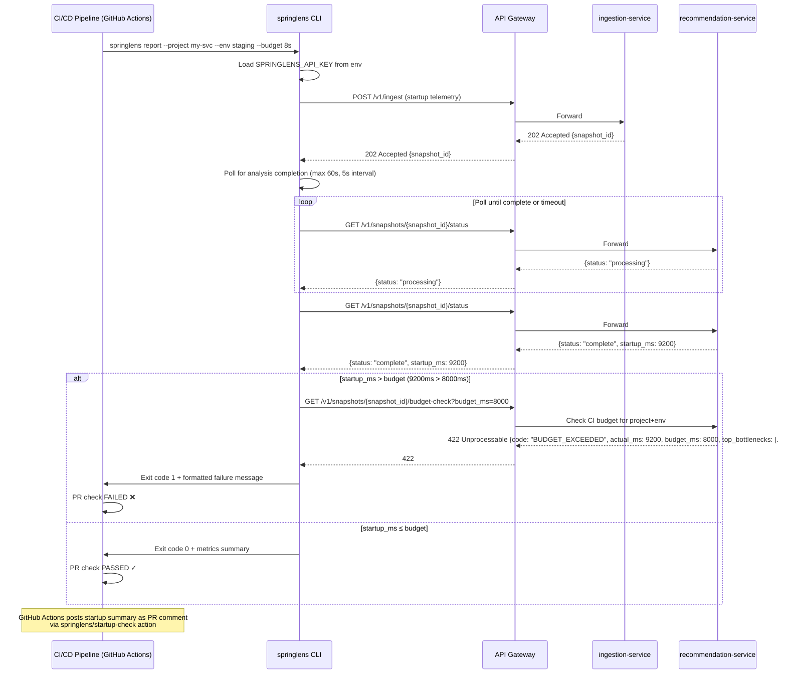

# Sequence Diagram — CI/CD Budget Gate

```mermaid
sequenceDiagram
    participant CI as CI/CD Pipeline (GitHub Actions)
    participant CLI as springlens CLI
    participant GW as API Gateway
    participant Ingest as ingestion-service
    participant RecSvc as recommendation-service

    CI->>CLI: springlens report --project my-svc --env staging --budget 8s
    CLI->>CLI: Load SPRINGLENS_API_KEY from env
    CLI->>GW: POST /v1/ingest (startup telemetry)
    GW->>Ingest: Forward
    Ingest-->>GW: 202 Accepted {snapshot_id}
    GW-->>CLI: 202 Accepted {snapshot_id}

    CLI->>CLI: Poll for analysis completion (max 60s, 5s interval)

    loop Poll until complete or timeout
        CLI->>GW: GET /v1/snapshots/{snapshot_id}/status
        GW->>RecSvc: Forward
        RecSvc-->>GW: {status: "processing"}
        GW-->>CLI: {status: "processing"}
    end

    CLI->>GW: GET /v1/snapshots/{snapshot_id}/status
    GW->>RecSvc: Forward
    RecSvc-->>GW: {status: "complete", startup_ms: 9200}
    GW-->>CLI: {status: "complete", startup_ms: 9200}

    alt startup_ms > budget (9200ms > 8000ms)
        CLI->>GW: GET /v1/snapshots/{snapshot_id}/budget-check?budget_ms=8000
        GW->>RecSvc: Check CI budget for project+env
        RecSvc-->>GW: 422 Unprocessable {code: "BUDGET_EXCEEDED", actual_ms: 9200, budget_ms: 8000, top_bottlenecks: [...]}
        GW-->>CLI: 422
        CLI->>CI: Exit code 1 + formatted failure message
        CI->>CI: PR check FAILED ❌
    else startup_ms ≤ budget
        CLI->>CI: Exit code 0 + metrics summary
        CI->>CI: PR check PASSED ✓
    end

    Note over CI: GitHub Actions posts startup summary as PR comment<br/>via springlens/startup-check action
```
