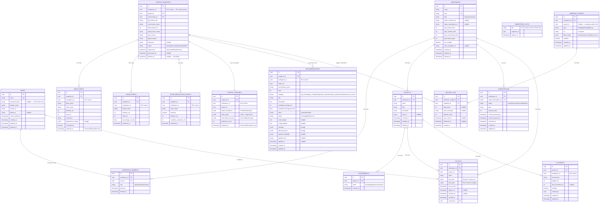

# SpringLens — Entity Relationship Diagram

```mermaid
erDiagram
    %% ─── AUTH SERVICE SCHEMA ───────────────────────────────────────────────

    USERS {
        uuid id PK
        string email UK
        string password_hash "nullable — null if OAuth only"
        string display_name
        string avatar_url
        string github_id "nullable"
        timestamp email_verified_at
        timestamp created_at
        timestamp updated_at
        timestamp deleted_at
    }

    WORKSPACES {
        uuid id PK
        string name
        string slug UK
        string plan "free|pro|enterprise"
        string stripe_customer_id "nullable"
        string stripe_subscription_id "nullable"
        int plan_project_limit
        int plan_member_limit
        int plan_environment_limit
        int plan_history_days
        boolean sso_enabled
        string saml_metadata_url "nullable"
        timestamp created_at
        timestamp updated_at
        timestamp deleted_at
    }

    WORKSPACE_MEMBERS {
        uuid id PK
        uuid workspace_id FK
        uuid user_id FK
        string role "admin|developer|viewer"
        timestamp joined_at
        timestamp deleted_at
    }

    API_KEYS {
        uuid id PK
        uuid workspace_id FK
        uuid project_id FK
        string name
        string key_hash "bcrypt of sl_proj_xxx"
        string key_prefix "first 8 chars for display"
        timestamp last_used_at
        timestamp expires_at "nullable"
        timestamp revoked_at "nullable"
        timestamp created_at
        uuid created_by FK
    }

    PROJECTS {
        uuid id PK
        uuid workspace_id FK
        string name
        string slug
        string description
        string repo_url "nullable"
        timestamp created_at
        timestamp updated_at
        timestamp deleted_at
    }

    ENVIRONMENTS {
        uuid id PK
        uuid project_id FK
        string name "dev|staging|production|ci|local"
        timestamp created_at
    }

    SUBSCRIPTIONS {
        uuid id PK
        uuid workspace_id FK
        string stripe_subscription_id UK
        string status "active|past_due|canceled|trialing"
        string plan
        int amount_cents
        timestamp current_period_start
        timestamp current_period_end
        timestamp canceled_at
        timestamp created_at
        timestamp updated_at
    }

    %% ─── INGESTION SERVICE SCHEMA (TimescaleDB) ─────────────────────────────

    STARTUP_SNAPSHOTS {
        uuid id PK
        uuid workspace_id "RLS column — FK to auth service"
        uuid project_id FK
        uuid environment_id FK
        string git_commit_sha
        string environment_name
        int total_startup_ms
        string spring_boot_version
        string java_version
        string agent_version
        string hostname "nullable"
        string status "queued|processing|complete|failed"
        timestamp captured_at "TimescaleDB partition key"
        timestamp processed_at "nullable"
        timestamp deleted_at "nullable — soft delete"
    }

    BEAN_EVENTS {
        uuid id PK
        uuid snapshot_id FK
        uuid workspace_id "RLS column"
        string bean_name
        string class_name
        int duration_ms
        int start_ms
        string context_id
        jsonb dependency_names "string[]"
        boolean is_bottleneck
        timestamp captured_at "TimescaleDB partition key"
    }

    PHASE_EVENTS {
        uuid id PK
        uuid snapshot_id FK
        uuid workspace_id "RLS column"
        string phase_name
        int duration_ms
        int start_ms
        float percentage_of_total
        timestamp captured_at
    }

    AUTOCONFIGURATION_EVENTS {
        uuid id PK
        uuid snapshot_id FK
        uuid workspace_id "RLS column"
        string class_name
        boolean matched
        int duration_ms
        int condition_evaluation_ms
        timestamp captured_at
    }

    IDEMPOTENCY_KEYS {
        string key PK "project_id:env:commit_sha"
        uuid snapshot_id
        timestamp expires_at
    }

    %% ─── ANALYSIS SERVICE SCHEMA (TimescaleDB) ──────────────────────────────

    STARTUP_TIMELINES {
        uuid id PK
        uuid snapshot_id UK
        uuid workspace_id "RLS column"
        uuid project_id
        jsonb phase_breakdown "PhaseBreakdown[]"
        jsonb bean_graph "nodes + edges DAG"
        jsonb autoconfig_summary "AutoconfigSummary[]"
        int bottleneck_count
        timestamp analyzed_at "TimescaleDB partition key"
    }

    %% ─── RECOMMENDATION SERVICE SCHEMA ─────────────────────────────────────

    RECOMMENDATIONS {
        uuid id PK
        uuid snapshot_id FK
        uuid workspace_id "RLS column"
        uuid project_id
        string environment_name
        int rank
        string category "lazy_loading|aot_compilation|graalvm_native|classpath_optimization|dependency_removal"
        string title
        text description
        int estimated_savings_ms
        float estimated_savings_percent
        string effort "low|medium|high"
        string status "active|applied|wont_fix"
        text code_snippet "nullable"
        text config_snippet "nullable"
        jsonb warnings "string[]"
        jsonb affected_beans "string[]"
        jsonb graalvm_feasibility "nullable"
        string applied_note "nullable"
        timestamp applied_at "nullable"
        timestamp created_at
        timestamp updated_at
    }

    CI_BUDGETS {
        uuid id PK
        uuid project_id FK
        uuid workspace_id "RLS column"
        string environment
        int budget_ms
        int alert_threshold_ms "nullable"
        boolean enabled
        uuid created_by
        timestamp created_at
        timestamp updated_at
    }

    %% ─── NOTIFICATION SERVICE SCHEMA ────────────────────────────────────────

    WEBHOOK_CONFIGS {
        uuid id PK
        uuid workspace_id FK
        uuid project_id "nullable — workspace-wide if null"
        string type "slack|pagerduty|github_pr"
        string url "encrypted"
        jsonb filter_config "environments, threshold_ms, etc."
        boolean enabled
        timestamp created_at
        timestamp updated_at
    }

    DELIVERY_LOG {
        uuid id PK
        uuid webhook_config_id FK
        uuid snapshot_id FK
        int http_status "nullable"
        string error_message "nullable"
        int attempt_count
        timestamp next_retry_at "nullable"
        timestamp delivered_at "nullable"
        timestamp created_at
    }

    %% ─── RELATIONSHIPS ──────────────────────────────────────────────────────

    USERS ||--o{ WORKSPACE_MEMBERS : "belongs to many"
    WORKSPACES ||--o{ WORKSPACE_MEMBERS : "has many"
    WORKSPACES ||--o{ PROJECTS : "has many"
    WORKSPACES ||--o{ SUBSCRIPTIONS : "has one"
    PROJECTS ||--o{ ENVIRONMENTS : "has many"
    PROJECTS ||--o{ API_KEYS : "has many"
    WORKSPACES ||--o{ API_KEYS : "has many"
    USERS ||--o{ API_KEYS : "created by"

    STARTUP_SNAPSHOTS ||--o{ BEAN_EVENTS : "has many"
    STARTUP_SNAPSHOTS ||--o{ PHASE_EVENTS : "has many"
    STARTUP_SNAPSHOTS ||--o{ AUTOCONFIGURATION_EVENTS : "has many"
    STARTUP_SNAPSHOTS ||--|| STARTUP_TIMELINES : "has one analysis"
    STARTUP_SNAPSHOTS ||--o{ RECOMMENDATIONS : "generates many"
    STARTUP_SNAPSHOTS ||--o{ DELIVERY_LOG : "triggers notifications"

    PROJECTS ||--o{ CI_BUDGETS : "has many"
    WEBHOOK_CONFIGS ||--o{ DELIVERY_LOG : "has many"
```
